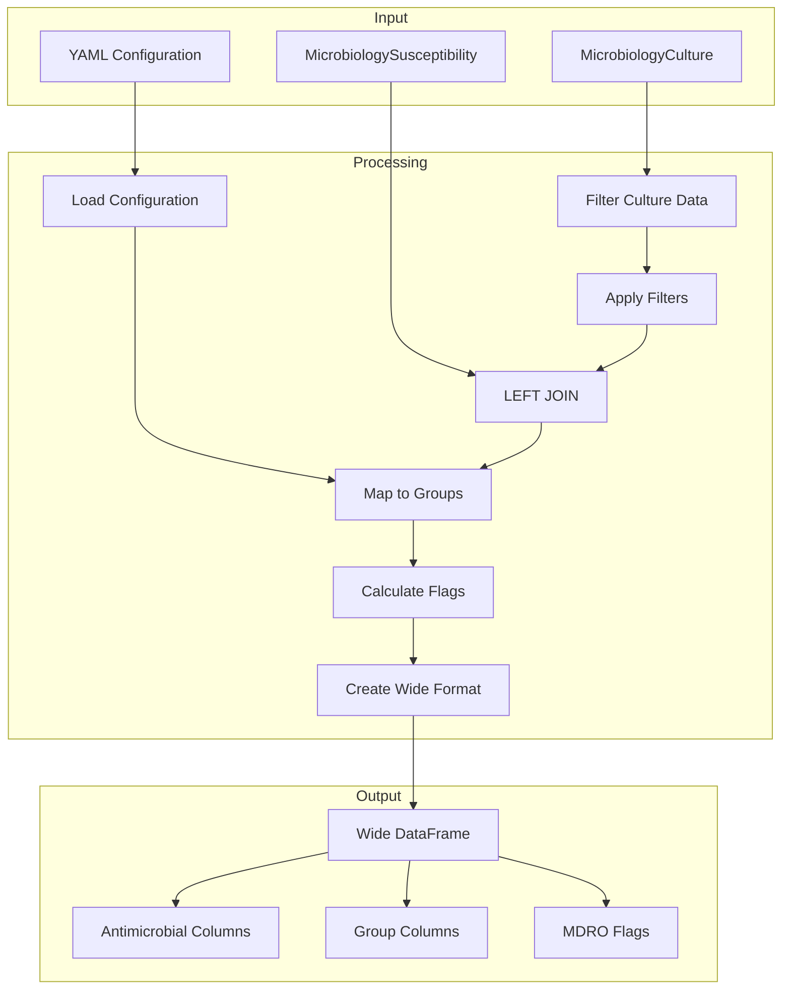
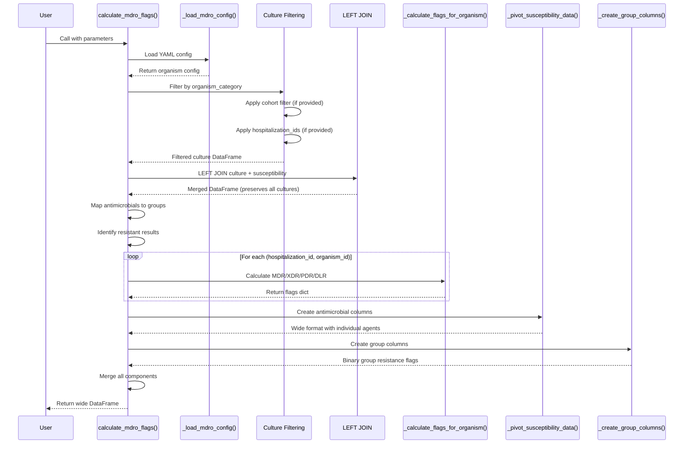
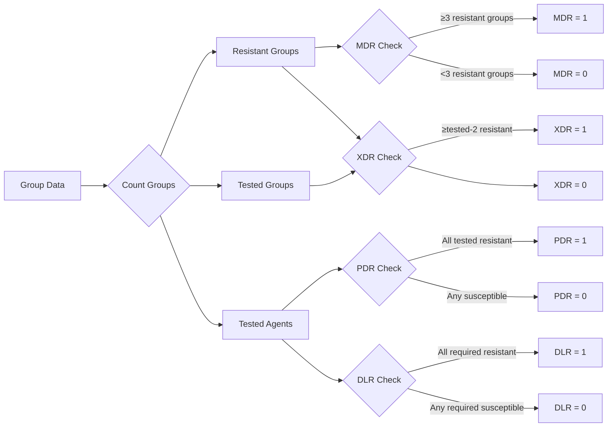

# MDRO Flags - Developer Guide

This guide provides technical implementation details for the MDRO (Multi-Drug Resistant Organism) flag calculation utility. It covers architecture, algorithms, data flow, and extensibility.

## Architecture Overview

The MDRO flags system consists of three main components:

```
clifpy/
├── data/
│   └── mdro.yaml                   # Configuration for organisms and criteria
├── utils/
│   └── mdro_flags.py              # Core implementation
└── tables/
    ├── microbiology_culture.py     # Culture table class
    └── microbiology_susceptibility.py  # Susceptibility table class
```

### Component Responsibilities

**Configuration (`mdro.yaml`)**
- Defines antimicrobial groupings for each organism
- Specifies resistance classification criteria (MDR/XDR/PDR/DLR)
- Provides extensibility for adding new organisms

**Utility Module (`mdro_flags.py`)**
- Main function: `calculate_mdro_flags()`
- Helper functions for data transformation
- Flag calculation logic
- Wide format generation

**Table Classes**
- Provide data validation and schema enforcement
- Handle data loading from various file formats
- Expose DataFrames for processing

## Data Flow

### High-Level Flow



### Detailed Processing Steps



## Core Algorithm

### Step 1: Configuration Loading

```python
def _load_mdro_config(config_path: Optional[str] = None) -> Dict[str, Any]:
    """
    Loads YAML configuration defining:
    - Antimicrobial groups (mapping antimicrobial_category -> group)
    - Resistant categories (what counts as resistant)
    - Resistance definitions (MDR/XDR/PDR/DLR criteria)
    """
    if config_path is None:
        # Use default: clifpy/data/mdro.yaml
        config_path = Path(__file__).parent.parent / 'data' / 'mdro.yaml'

    with open(config_path, 'r') as f:
        return yaml.safe_load(f)
```

### Step 2: Culture Filtering

**Filters are applied in this order:**
1. Filter by `organism_category` (e.g., 'pseudomonas_aeruginosa')
2. Apply cohort date filtering (if cohort provided)
3. Apply hospitalization_ids filtering (if provided)

```python
# Filter by organism
culture_filtered = culture_df[
    culture_df['organism_category'] == organism_name
].copy()

# Apply cohort filtering (checks result_dttm within date range)
if cohort is not None:
    culture_filtered = _apply_cohort_filter_to_culture(culture_filtered, cohort)

# Apply hospitalization ID filtering
if hospitalization_ids is not None:
    culture_filtered = culture_filtered[
        culture_filtered['hospitalization_id'].isin(hospitalization_ids)
    ].copy()
```

### Step 3: LEFT JOIN Susceptibility Data

**Why LEFT JOIN?**
- Preserves ALL organism cultures, even without susceptibility testing
- Allows tracking of untested organisms
- More accurate representation of clinical reality

```python
merged_df = pd.merge(
    culture_filtered[['organism_id', 'hospitalization_id', 'organism_category']],
    susceptibility_df[['organism_id', 'antimicrobial_category', 'susceptibility_category']],
    on='organism_id',
    how='left'  # Preserves all culture rows
)

# Track organisms without testing
organisms_without_susc = merged_df[
    merged_df['antimicrobial_category'].isna()
]['organism_id'].nunique()
```

### Step 4: Antimicrobial Group Mapping

Maps individual antimicrobials to their therapeutic groups:

```python
# Build mapping from config
antimicrobial_groups = organism_config['antimicrobial_groups']
category_to_group = {}
for group_name, categories in antimicrobial_groups.items():
    for category in categories:
        category_to_group[category] = group_name

# Apply mapping
merged_df['antimicrobial_group'] = merged_df['antimicrobial_category'].map(
    category_to_group
)
```

**Example for P. aeruginosa:**
```python
{
    'gentamicin': 'aminoglycosides',
    'tobramycin': 'aminoglycosides',
    'ciprofloxacin': 'antipseudomonal_fluoroquinolones',
    'levofloxacin': 'antipseudomonal_fluoroquinolones',
    # ... etc
}
```

### Step 5: Resistance Identification

Both 'intermediate' and 'non_susceptible' are considered resistant:

```python
resistant_categories = organism_config.get(
    'resistant_categories',
    ['non_susceptible', 'intermediate']
)

merged_df['is_resistant'] = merged_df['susceptibility_category'].isin(
    resistant_categories
)
```

### Step 6: Flag Calculation

For each `(hospitalization_id, organism_id)` pair:



#### MDR (Multi-Drug Resistant)

```python
if criteria_type == 'min_groups_resistant':
    min_groups = criteria['min_groups']  # 3 for P. aeruginosa
    flags[column_name] = 1 if num_resistant_groups >= min_groups else 0
```

#### XDR (Extensively Drug Resistant)

```python
elif criteria_type == 'max_groups_susceptible':
    max_groups_susceptible = criteria['max_groups_susceptible']  # 2
    min_resistant_for_xdr = num_tested_groups - max_groups_susceptible
    flags[column_name] = 1 if num_resistant_groups >= min_resistant_for_xdr else 0
```

**Example:** If 7 groups tested and organism resistant to 6+ groups → XDR

#### PDR (Pandrug Resistant)

```python
elif criteria_type == 'all_tested_resistant':
    flags[column_name] = 1 if num_resistant_agents == num_tested_agents else 0
```

#### DLR (Difficult to Treat)

```python
elif criteria_type == 'specific_agents_resistant':
    required_agents = criteria['required_agents']  # List of 8 agents for P. aeruginosa

    # Check which required agents were tested
    tested_required = [a for a in required_agents if a in tested_agents]

    # Check which of those are resistant
    resistant_required = [a for a in tested_required if a in resistant_agents]

    # Flag as DLR if all tested required agents are resistant
    if len(tested_required) > 0:
        flags[column_name] = 1 if len(resistant_required) == len(tested_required) else 0
    else:
        flags[column_name] = 0
```

### Step 7: Wide Format Transformation

#### 7a. Create Antimicrobial Columns

Handles duplicate tests by prioritizing most resistant result:

```python
def _prioritize_susceptibility(susceptibility_value: str) -> int:
    """Lower number = higher priority (more resistant)"""
    return {
        'non_susceptible': 1,
        'intermediate': 2,
        'susceptible': 3,
        'NA': 4
    }.get(susceptibility_value, 5)

def _pivot_susceptibility_data(merged_df, organism_config):
    # Add priority for sorting
    merged_df['_priority'] = merged_df['susceptibility_category'].apply(
        _prioritize_susceptibility
    )

    # Sort by priority (lower = more resistant)
    merged_df = merged_df.sort_values('_priority')

    # Remove duplicates, keeping first (most resistant)
    deduplicated = merged_df.drop_duplicates(
        subset=['hospitalization_id', 'organism_id', 'antimicrobial_category'],
        keep='first'
    )

    # Pivot to wide format
    pivoted = deduplicated.pivot_table(
        index=['hospitalization_id', 'organism_id'],
        columns='antimicrobial_category',
        values='susceptibility_category',
        aggfunc='first'
    )

    return pivoted.reset_index()
```

#### 7b. Create Group Columns

Binary flags indicating if ANY agent in a group is resistant:

```python
def _create_group_columns(merged_df, antimicrobial_groups, resistant_categories):
    # Mark resistant results
    merged_df['is_resistant'] = merged_df['susceptibility_category'].isin(
        resistant_categories
    )

    # Group by organism and antimicrobial_group, check if ANY agent resistant
    group_resistance = merged_df.groupby(
        ['hospitalization_id', 'organism_id', 'antimicrobial_group']
    )['is_resistant'].any().reset_index()

    # Pivot to create one column per group
    group_pivoted = group_resistance.pivot_table(
        index=['hospitalization_id', 'organism_id'],
        columns='antimicrobial_group',
        values='is_resistant',
        aggfunc='any'
    )

    # Convert boolean to int (1/0)
    group_pivoted = group_pivoted.fillna(False).astype(int)

    return group_pivoted.reset_index()
```

#### 7c. Merge Components

```python
# Merge flags + antimicrobial columns + group columns
result_df = flags_df.merge(
    antimicrobial_df,
    on=['hospitalization_id', 'organism_id'],
    how='left'
).merge(
    group_df,
    on=['hospitalization_id', 'organism_id'],
    how='left'
)

# Organize columns: IDs, antimicrobials, groups, flags
column_order = (
    id_cols +
    sorted(antimicrobial_cols) +
    sorted(group_cols) +
    sorted(flag_cols)
)
```

## Configuration Schema

### YAML Structure

```yaml
organisms:
  pseudomonas_aeruginosa:
    display_name: "Pseudomonas aeruginosa"

    antimicrobial_groups:
      aminoglycosides:
        - gentamicin
        - tobramycin
        - amikacin
        - netilmicin
      # ... more groups

    resistant_categories:
      - non_susceptible
      - intermediate

    resistance_definitions:
      mdr:
        name: "Multi-Drug Resistant"
        description: "..."
        criteria:
          type: "min_groups_resistant"
          min_groups: 3
        column_name: "mdro_psar_mdr"
      # ... more definitions
```

### Criteria Types

**1. min_groups_resistant**
- Used for: MDR classification
- Parameters:
  - `min_groups` (int): Minimum number of groups with resistance
- Logic: `num_resistant_groups >= min_groups`

**2. max_groups_susceptible**
- Used for: XDR classification
- Parameters:
  - `max_groups_susceptible` (int): Maximum groups allowed to be susceptible
- Logic: `num_resistant_groups >= (num_tested_groups - max_groups_susceptible)`

**3. all_tested_resistant**
- Used for: PDR classification
- Parameters: None
- Logic: `num_resistant_agents == num_tested_agents`

**4. specific_agents_resistant**
- Used for: DLR classification
- Parameters:
  - `required_agents` (list): Specific antimicrobials that must all be resistant
- Logic: All tested required agents must be resistant

## Adding New Organisms

### Step 1: Define Antimicrobial Groups

Research clinical guidelines (CLSI, EUCAST, CDC) to identify:
- Relevant antimicrobial classes for the organism
- Individual agents within each class
- Standard testing panels

### Step 2: Update mdro.yaml

```yaml
organisms:
  # Existing organisms...

  acinetobacter_baumannii:
    display_name: "Acinetobacter baumannii"

    antimicrobial_groups:
      carbapenems:
        - imipenem
        - meropenem
        - doripenem
      aminoglycosides:
        - gentamicin
        - tobramycin
        - amikacin
      fluoroquinolones:
        - ciprofloxacin
        - levofloxacin
      beta_lactam_beta_lactamase_inhibitors:
        - ampicillin_sulbactam
      tetracyclines:
        - minocycline
        - doxycycline
      polymyxins:
        - colistin
        - polymyxin_b
      sulbactam:
        - sulbactam
      tigecycline:
        - tigecycline

    resistant_categories:
      - non_susceptible
      - intermediate

    resistance_definitions:
      mdr:
        name: "Multi-Drug Resistant"
        description: "Non-susceptible to ≥1 agent in ≥3 antimicrobial categories"
        criteria:
          type: "min_groups_resistant"
          min_groups: 3
        column_name: "mdro_abau_mdr"

      xdr:
        name: "Extensively Drug Resistant"
        description: "Non-susceptible to ≥1 agent in all but ≤2 categories"
        criteria:
          type: "max_groups_susceptible"
          max_groups_susceptible: 2
        column_name: "mdro_abau_xdr"

      pdr:
        name: "Pandrug Resistant"
        description: "Non-susceptible to all antimicrobial agents"
        criteria:
          type: "all_tested_resistant"
        column_name: "mdro_abau_pdr"
```

### Step 3: Test the Configuration

```python
from clifpy.tables import MicrobiologyCulture, MicrobiologySusceptibility
from clifpy.utils.mdro_flags import calculate_mdro_flags

# Test with sample data
culture = MicrobiologyCulture(data=test_culture_data)
susceptibility = MicrobiologySusceptibility(data=test_susc_data)

# Calculate flags for new organism
flags = calculate_mdro_flags(
    culture=culture,
    susceptibility=susceptibility,
    organism_name='acinetobacter_baumannii'
)

# Verify output
assert 'mdro_abau_mdr' in flags.columns
assert 'mdro_abau_xdr' in flags.columns
print(f"Successfully configured: {flags.shape[0]} organisms classified")
```

### Step 4: Update Documentation

1. Add organism to "Supported Organisms" section in user guide
2. Document antimicrobial groups and criteria
3. Add example usage

## Performance Optimization

### Memory Considerations

Wide format output creates one column per antimicrobial tested:

```python
# Estimate column count
num_id_cols = 2  # hospitalization_id, organism_id
num_antimicrobial_cols = susceptibility.df['antimicrobial_category'].nunique()
num_group_cols = len(organism_config['antimicrobial_groups'])
num_flag_cols = len(organism_config['resistance_definitions'])

total_cols = num_id_cols + num_antimicrobial_cols + num_group_cols + num_flag_cols

print(f"Expected output columns: {total_cols}")
```

For datasets with >50 unique antimicrobials, consider:
- Filtering to specific antimicrobials of interest
- Processing in batches
- Using sparse matrix representations (future enhancement)

### Processing Speed

Typical performance on standard hardware:

| Dataset Size | Processing Time | Memory Usage |
|-------------|-----------------|--------------|
| 1K organisms | <1 second | <10 MB |
| 10K organisms | 1-3 seconds | 50-100 MB |
| 100K organisms | 10-30 seconds | 500 MB - 1 GB |
| 1M organisms | 2-5 minutes | 5-10 GB |

**Optimization strategies:**

1. **Pre-filter culture data** before calling function
2. **Use hospitalization_ids** parameter for targeted analysis
3. **Process by time periods** (monthly/quarterly batches)
4. **Use appropriate data types** in source tables

## Testing Strategy

### Unit Tests

```python
def test_prioritize_susceptibility():
    """Test resistance prioritization."""
    assert _prioritize_susceptibility('non_susceptible') == 1
    assert _prioritize_susceptibility('intermediate') == 2
    assert _prioritize_susceptibility('susceptible') == 3
    assert _prioritize_susceptibility('NA') == 4

def test_calculate_flags_mdr():
    """Test MDR flag calculation."""
    # Create test data with resistance in 3 groups
    test_data = pd.DataFrame({
        'antimicrobial_category': ['gentamicin', 'ciprofloxacin', 'ceftazidime'],
        'susceptibility_category': ['non_susceptible', 'non_susceptible', 'non_susceptible'],
        'antimicrobial_group': ['aminoglycosides', 'fluoroquinolones', 'cephalosporins'],
        'is_resistant': [True, True, True]
    })

    flags = _calculate_flags_for_organism(test_data, resistance_defs, antimicrobial_groups)
    assert flags['mdro_psar_mdr'] == 1
```

### Integration Tests

```python
def test_end_to_end_pseudomonas():
    """Test complete workflow for P. aeruginosa."""
    # Setup test data
    culture_data = pd.DataFrame({...})
    susc_data = pd.DataFrame({...})

    culture = MicrobiologyCulture(data=culture_data)
    susceptibility = MicrobiologySusceptibility(data=susc_data)

    # Run calculation
    result = calculate_mdro_flags(culture, susceptibility, 'pseudomonas_aeruginosa')

    # Verify structure
    assert 'hospitalization_id' in result.columns
    assert 'organism_id' in result.columns
    assert 'mdro_psar_mdr' in result.columns
    assert len(result) > 0
```

### Data Quality Tests

```python
def test_duplicate_handling():
    """Test that duplicates are handled correctly."""
    # Create data with duplicate tests
    susc_data = pd.DataFrame({
        'organism_id': ['ORG1', 'ORG1'],
        'antimicrobial_category': ['gentamicin', 'gentamicin'],
        'susceptibility_category': ['susceptible', 'non_susceptible']
    })

    # Should keep most resistant (non_susceptible)
    result = _pivot_susceptibility_data(...)
    assert result.loc[0, 'gentamicin'] == 'non_susceptible'
```

## Error Handling

### Common Error Cases

**1. Organism Not Found**
```python
if organism_name not in config['organisms']:
    available_organisms = ', '.join(config['organisms'].keys())
    raise ValueError(
        f"Organism '{organism_name}' not found in configuration. "
        f"Available organisms: {available_organisms}"
    )
```

**2. Missing Columns**
```python
required_cols = ['organism_id', 'hospitalization_id', 'organism_category']
missing = [col for col in required_cols if col not in culture_df.columns]
if missing:
    raise ValueError(f"Missing required columns in culture table: {missing}")
```

**3. No Data After Filtering**
```python
if len(culture_filtered) == 0:
    logger.warning(f"No data found for organism: {organism_name}")
    return pd.DataFrame(columns=['hospitalization_id', 'organism_id'])
```

## Logging

The module uses Python's logging module for tracking:

```python
import logging

logger = logging.getLogger(__name__)

# Info-level logging for normal operations
logger.info(f"Filtered culture to {organism_name}: {len(culture_filtered)} rows")
logger.info(f"After cohort filtering: {len(culture_filtered)} rows")
logger.info(f"{organisms_without_susc} organism(s) have no susceptibility testing data")

# Warning-level for potential issues
logger.warning("No data remaining after filtering")
logger.warning("No organisms with susceptibility data found")
```

## Future Enhancements

### Potential Improvements

1. **Additional Organisms**
   - Klebsiella pneumoniae (carbapenem-resistant)
   - Enterococcus faecium (VRE)
   - Staphylococcus aureus (MRSA)
   - Enterobacterales (ESBL, CRE)

2. **Performance Optimizations**
   - Sparse matrix support for wide format
   - Parallel processing for large datasets
   - Caching of configuration parsing

3. **Additional Features**
   - Time-series tracking of resistance emergence
   - Resistance score calculation (weighted)
   - Cluster detection (related organisms)
   - Export to standard formats (NHSN, WHO Glass)

4. **Validation Enhancements**
   - Detect unlikely resistance patterns
   - Flag low-quality susceptibility data
   - Warn about incomplete testing panels

## References

### Clinical Guidelines

- CLSI M100 Performance Standards for Antimicrobial Susceptibility Testing
- EUCAST Clinical Breakpoint Tables
- CDC MDR/XDR definitions for gram-negative bacteria

### Implementation Standards

- Magiorakos AP, et al. (2012) MDR/XDR/PDR definitions
- Kadri SS, et al. (2018) Difficult-to-Treat Resistance criteria
- CLIF Specification v2.0 - Microbiology tables

### Code References

- `clifpy/utils/mdro_flags.py` - Main implementation
- `clifpy/data/mdro.yaml` - Configuration schema
- `clifpy/tables/microbiology_culture.py` - Culture table class
- `clifpy/tables/microbiology_susceptibility.py` - Susceptibility table class
- `tests/test_mdro_flags.py` - Test suite
- `examples/mdro_flags_demo.py` - Interactive demo

## Contributing

When contributing to the MDRO flags functionality:

1. **Follow existing patterns** - Match code style and structure
2. **Add tests** - Unit tests for helpers, integration tests for end-to-end
3. **Update documentation** - Both user guide and developer guide
4. **Validate clinically** - Verify criteria against published literature
5. **Benchmark performance** - Test with realistic dataset sizes

For questions or suggestions, open an issue on the [CLIFpy GitHub repository](https://github.com/clif-consortium/CLIFpy/issues).
