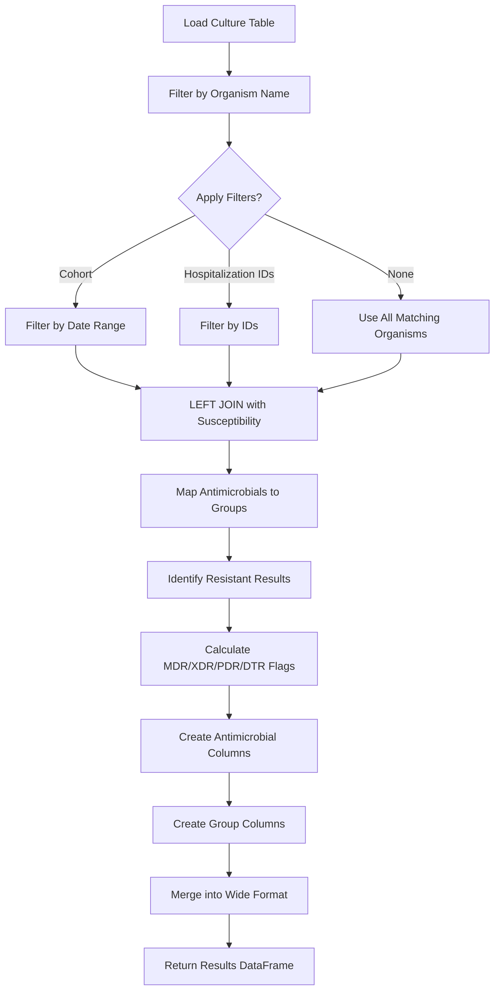

# MDRO Flag Calculation

The MDRO (Multi-Drug Resistant Organism) flag calculation utility identifies and classifies organisms based on antimicrobial susceptibility testing results. It automatically calculates MDR, XDR, PDR, and DLR flags according to standardized clinical criteria.

## Overview

Multi-drug resistant organisms pose significant challenges in healthcare settings. Proper identification and classification of resistance patterns is crucial for:

- **Infection control** - Implementing appropriate isolation and prevention measures
- **Treatment decisions** - Guiding antibiotic selection and escalation
- **Surveillance** - Tracking resistance trends over time
- **Research** - Studying outcomes and risk factors for resistant infections

The MDRO flag calculator automates the classification of organisms into standardized resistance categories based on antimicrobial susceptibility testing (AST) results.

### Supported Classifications

- **MDR (Multi-Drug Resistant)** - Non-susceptible to ≥1 agent in ≥3 antimicrobial categories
- **XDR (Extensively Drug Resistant)** - Non-susceptible to ≥1 agent in all but ≤2 categories
- **PDR (Pandrug Resistant)** - Non-susceptible to all antimicrobial agents tested
- **DTR (Difficult to Treat Resistance)** - Non-susceptible to specific key antimicrobials (organism-specific)

### Currently Supported Organisms

- **Pseudomonas aeruginosa** - Common healthcare-associated pathogen with 8 antimicrobial groups

The system is designed to be extensible - additional organisms can be easily added through the YAML configuration file.

## How It Works

The MDRO flag calculation follows a systematic workflow:



### Key Processing Steps

1. **Culture Filtering** - Filters the culture table to the specified organism (e.g., *Pseudomonas aeruginosa*)
2. **Optional Filtering** - Applies cohort date ranges or specific hospitalization IDs if provided
3. **Susceptibility Join** - LEFT JOIN preserves all organism cultures, even without susceptibility data
4. **Group Mapping** - Maps individual antimicrobials (e.g., ciprofloxacin) to groups (e.g., fluoroquinolones)
5. **Resistance Classification** - Identifies resistant results (both 'intermediate' and 'non_susceptible')
6. **Flag Calculation** - Applies organism-specific criteria to determine MDR/XDR/PDR/DTR status
7. **Wide Format Creation** - Pivots results to include individual antimicrobial and group columns for verification

## Basic Usage

### Quick Start

```python
from clifpy.tables import MicrobiologyCulture, MicrobiologySusceptibility
from clifpy.utils.mdro_flags import calculate_mdro_flags

# Load your microbiology data
culture = MicrobiologyCulture(
    data_directory='/path/to/data',
    filetype='parquet'
)

susceptibility = MicrobiologySusceptibility(
    data_directory='/path/to/data',
    filetype='parquet'
)

# Calculate MDRO flags for all P. aeruginosa
mdro_flags = calculate_mdro_flags(
    culture=culture,
    susceptibility=susceptibility,
    organism_name='pseudomonas_aeruginosa'
)

# View results
print(mdro_flags.head())
```

### With Specific Hospitalizations

```python
# Calculate flags for specific encounters only
target_hospitalizations = ['H001', 'H002', 'H003']

mdro_flags = calculate_mdro_flags(
    culture=culture,
    susceptibility=susceptibility,
    organism_name='pseudomonas_aeruginosa',
    hospitalization_ids=target_hospitalizations
)
```

### With Cohort Date Filtering

```python
import pandas as pd

# Define a cohort with date ranges
cohort_df = pd.DataFrame({
    'hospitalization_id': ['H001', 'H002', 'H003'],
    'start_dttm': ['2023-01-01', '2023-01-15', '2023-02-01'],
    'end_dttm': ['2023-01-10', '2023-01-25', '2023-02-15']
})

# Only include organism cultures within cohort time windows
mdro_flags = calculate_mdro_flags(
    culture=culture,
    susceptibility=susceptibility,
    organism_name='pseudomonas_aeruginosa',
    cohort=cohort_df
)
```

## Parameters

### Function Parameters

| Parameter | Type | Required | Default | Description |
|-----------|------|----------|---------|-------------|
| `culture` | MicrobiologyCulture | Yes | - | Culture table object containing organism data |
| `susceptibility` | MicrobiologySusceptibility | Yes | - | Susceptibility table object with AST results |
| `organism_name` | str | Yes | - | Organism to classify (must match `organism_category` value) |
| `cohort` | pd.DataFrame | No | None | Cohort with hospitalization_id, start_dttm, end_dttm for date filtering |
| `hospitalization_ids` | List[str] | No | None | Specific hospitalization IDs to include |
| `config_path` | str | No | None | Path to custom MDRO configuration YAML (uses default if not specified) |

### Required Data Columns

**Culture Table:**
- `patient_id`
- `hospitalization_id`
- `organism_id` - Unique identifier for each organism culture
- `organism_category` - Standardized organism name (e.g., 'pseudomonas_aeruginosa')
- `result_dttm` - Result datetime (for cohort filtering)

**Susceptibility Table:**
- `organism_id` - Links to culture table
- `antimicrobial_category` - Standardized antimicrobial name (e.g., 'ciprofloxacin')
- `susceptibility_category` - Result: 'susceptible', 'intermediate', 'non_susceptible', or 'NA'

## Understanding the Output

The function returns a wide-format DataFrame designed for easy verification and analysis.

### Output Structure

```python
# Example output columns
hospitalization_id | organism_id | amikacin_agent | ciprofloxacin_agent | ... | aminoglycosides_group | fluoroquinolones_group | ... | mdro_psar_mdr | mdro_psar_xdr
```

### Column Types

**1. Identifier Columns**
- `hospitalization_id` - Hospital encounter identifier
- `organism_id` - Unique organism culture identifier

**2. Individual Antimicrobial Columns**
- One column per antimicrobial agent tested (with `_agent` suffix)
- Values: 'susceptible', 'intermediate', 'non_susceptible', 'NA', or None (not tested)
- Example columns: `amikacin_agent`, `ciprofloxacin_agent`, `ceftazidime_agent`, `meropenem_agent`

**3. Antimicrobial Group Columns**
- One column per antimicrobial group (with `_group` suffix)
- Binary values: 1 (resistant to ≥1 agent in group), 0 (susceptible to all tested agents)
- Allows quick identification of which drug classes are affected
- Example columns: `aminoglycosides_group`, `carbapenems_group`, `fluoroquinolones_group`

**4. MDRO Flag Columns**
- `mdro_psar_mdr` - Multi-Drug Resistant flag (0/1)
- `mdro_psar_xdr` - Extensively Drug Resistant flag (0/1)
- `mdro_psar_pdr` - Pandrug Resistant flag (0/1)
- `mdro_psar_dtr` - Difficult to Treat Resistance flag (0/1)

### Interpreting Results

```python
# Load results
mdro_flags = calculate_mdro_flags(culture, susceptibility, 'pseudomonas_aeruginosa')

# Count resistance patterns
mdr_count = mdro_flags['mdro_psar_mdr'].sum()
xdr_count = mdro_flags['mdro_psar_xdr'].sum()
pdr_count = mdro_flags['mdro_psar_pdr'].sum()
dtr_count = mdro_flags['mdro_psar_dtr'].sum()

print(f"MDR organisms: {mdr_count}")
print(f"XDR organisms: {xdr_count}")
print(f"PDR organisms: {pdr_count}")
print(f"DTR organisms: {dtr_count}")

# View a specific organism's results
organism_detail = mdro_flags[mdro_flags['organism_id'] == 'ORG123']
print(organism_detail)
```

### Handling Duplicates

If an organism has multiple tests for the same antimicrobial, the **most resistant** result is automatically selected:

- Priority: `non_susceptible` > `intermediate` > `susceptible` > `NA`

## Practical Examples

### Example 1: Surveillance Report

```python
from clifpy.tables import MicrobiologyCulture, MicrobiologySusceptibility
from clifpy.utils.mdro_flags import calculate_mdro_flags
import pandas as pd

# Load data
culture = MicrobiologyCulture(data_directory='./data', filetype='parquet')
susceptibility = MicrobiologySusceptibility(data_directory='./data', filetype='parquet')

# Calculate flags
mdro = calculate_mdro_flags(culture, susceptibility, 'pseudomonas_aeruginosa')

# Create surveillance summary
summary = pd.DataFrame({
    'Total Organisms': [len(mdro)],
    'MDR (%)': [f"{mdro['mdro_psar_mdr'].sum()} ({mdro['mdro_psar_mdr'].mean()*100:.1f}%)"],
    'XDR (%)': [f"{mdro['mdro_psar_xdr'].sum()} ({mdro['mdro_psar_xdr'].mean()*100:.1f}%)"],
    'PDR (%)': [f"{mdro['mdro_psar_pdr'].sum()} ({mdro['mdro_psar_pdr'].mean()*100:.1f}%)"],
    'DTR (%)': [f"{mdro['mdro_psar_dtr'].sum()} ({mdro['mdro_psar_dtr'].mean()*100:.1f}%)"]
})

print("P. aeruginosa Resistance Summary")
print(summary.to_string(index=False))
```

### Example 2: Identify High-Risk Patients

```python
# Find hospitalizations with XDR or PDR organisms
high_risk = mdro[
    (mdro['mdro_psar_xdr'] == 1) | (mdro['mdro_psar_pdr'] == 1)
][['hospitalization_id', 'organism_id', 'mdro_psar_xdr', 'mdro_psar_pdr']]

print(f"High-risk encounters: {high_risk['hospitalization_id'].nunique()}")
print(high_risk)
```

### Example 3: Analyze Resistance Patterns

```python
# Check which antimicrobial groups are most commonly resistant
group_cols = [col for col in mdro.columns if col.endswith('_group')]

resistance_by_group = mdro[group_cols].sum().sort_values(ascending=False)
print("Organisms resistant to each antimicrobial group:")
print(resistance_by_group)
```

### Example 4: Verify Classification

```python
# Deep dive into why an organism was flagged as MDR
organism_id = 'ORG123'
org_data = mdro[mdro['organism_id'] == organism_id]

# Get all antimicrobial columns (individual agents with _agent suffix)
antimicrobial_cols = [col for col in org_data.columns if col.endswith('_agent')]

# Show only tested antimicrobials
tested = org_data[antimicrobial_cols].iloc[0]
tested = tested[tested.notna()]

# Filter to resistant results
resistant = tested[tested.isin(['intermediate', 'non_susceptible'])]

print(f"Organism {organism_id}:")
print(f"MDR Status: {org_data['mdro_psar_mdr'].iloc[0]}")
print(f"\nResistant to {len(resistant)} antimicrobials:")
print(resistant)
```

### Example 5: Monthly Trend Analysis

```python
# Add culture result date
culture_dates = culture.df[['organism_id', 'result_dttm']].copy()
mdro_with_dates = mdro.merge(culture_dates, on='organism_id', how='left')

# Extract month
mdro_with_dates['year_month'] = pd.to_datetime(
    mdro_with_dates['result_dttm']
).dt.to_period('M')

# Calculate monthly MDR rates
monthly_trends = mdro_with_dates.groupby('year_month').agg({
    'organism_id': 'count',
    'mdro_psar_mdr': 'sum',
    'mdro_psar_xdr': 'sum',
    'mdro_psar_pdr': 'sum'
}).rename(columns={'organism_id': 'total_organisms'})

monthly_trends['mdr_rate'] = (
    monthly_trends['mdro_psar_mdr'] / monthly_trends['total_organisms'] * 100
)

print("Monthly MDR Trends:")
print(monthly_trends)
```

## MDRO Classification Criteria

### Pseudomonas aeruginosa

The function uses 8 antimicrobial groups for *P. aeruginosa* classification:

1. **Aminoglycosides** - gentamicin, tobramycin, amikacin, netilmicin
2. **Antipseudomonal Carbapenems** - imipenem, meropenem, doripenem
3. **Antipseudomonal Cephalosporins** - ceftazidime, cefepime
4. **Antipseudomonal Fluoroquinolones** - ciprofloxacin, levofloxacin
5. **Antipseudomonal Penicillins + β-lactamase Inhibitors** - piperacillin-tazobactam, ticarcillin-clavulanate
6. **Monobactams** - aztreonam
7. **Phosphonic Acids** - fosfomycin
8. **Polymyxins** - colistin, polymyxin B

#### Classification Definitions

**MDR (Multi-Drug Resistant)**
- Non-susceptible to ≥1 agent in ≥3 antimicrobial groups
- Example: Resistant to ciprofloxacin (fluoroquinolones), ceftazidime (cephalosporins), and gentamicin (aminoglycosides)

**XDR (Extensively Drug Resistant)**
- Non-susceptible to ≥1 agent in all but ≤2 antimicrobial groups
- Example: Resistant to 6 out of 8 groups (susceptible to only polymyxins and fosfomycin)

**PDR (Pandrug Resistant)**
- Non-susceptible to ALL antimicrobial agents tested
- Most severe classification

**DTR (Difficult to Treat Resistance)**
- ALL 8 specific agents must be tested AND all must be non-susceptible:
  - Piperacillin-tazobactam
  - Ceftazidime
  - Cefepime
  - Aztreonam
  - Meropenem
  - Imipenem
  - Ciprofloxacin
  - Levofloxacin

## Best Practices

### 1. Data Quality Checks

```python
# Before running MDRO calculation, verify data quality

# Check for missing organism IDs
missing_organism_id = culture.df['organism_id'].isna().sum()
if missing_organism_id > 0:
    print(f"Warning: {missing_organism_id} cultures missing organism_id")

# Check susceptibility linkage
linked = susceptibility.df['organism_id'].isin(culture.df['organism_id']).sum()
total_susc = len(susceptibility.df)
print(f"Susceptibility tests linked to culture: {linked}/{total_susc}")

# Verify organism names
unique_organisms = culture.df['organism_category'].value_counts()
print("Top organisms in culture data:")
print(unique_organisms.head(10))
```

### 2. Interpret in Clinical Context

- **Consider testing completeness** - Not all antimicrobials may be tested for every organism
- **Review intermediate results** - Both 'intermediate' and 'non_susceptible' count as resistant
- **Check local epidemiology** - Resistance patterns vary by geography and institution
- **Validate flagged organisms** - Spot-check results against clinical microbiology reports

### 3. Document Your Analysis

```python
# Save analysis metadata
metadata = {
    'analysis_date': pd.Timestamp.now(),
    'organism': 'pseudomonas_aeruginosa',
    'total_cultures': len(culture.df),
    'total_psar': (culture.df['organism_category'] == 'pseudomonas_aeruginosa').sum(),
    'psar_with_susceptibility': len(mdro),
    'mdr_count': mdro['mdro_psar_mdr'].sum(),
    'xdr_count': mdro['mdro_psar_xdr'].sum(),
    'config_used': 'clifpy/data/mdro.yaml'
}

# Save for reproducibility
import json
with open('mdro_analysis_metadata.json', 'w') as f:
    json.dump({k: str(v) for k, v in metadata.items()}, f, indent=2)
```

### 4. Filter Appropriately

```python
# For ICU-specific analysis, use cohort filtering
icu_cohort = pd.DataFrame({
    'hospitalization_id': icu_patient_ids,
    'start_dttm': icu_admission_times,
    'end_dttm': icu_discharge_times
})

icu_mdro = calculate_mdro_flags(
    culture, susceptibility, 'pseudomonas_aeruginosa',
    cohort=icu_cohort
)
```

## Integration with ClifOrchestrator

If using the ClifOrchestrator, you can streamline the workflow:

```python
from clifpy import ClifOrchestrator
from clifpy.utils.mdro_flags import calculate_mdro_flags

# Initialize orchestrator
clif = ClifOrchestrator(
    data_directory='/path/to/data',
    filetype='parquet',
    timezone='UTC'
)

# Load required tables
clif.initialize([
    'hospitalization',
    'microbiology_culture',
    'microbiology_susceptibility'
])

# Calculate MDRO flags
mdro_flags = calculate_mdro_flags(
    culture=clif.microbiology_culture,
    susceptibility=clif.microbiology_susceptibility,
    organism_name='pseudomonas_aeruginosa'
)

# Merge with hospitalization data for further analysis
hosps_with_mdro = clif.hospitalization.df.merge(
    mdro_flags,
    on='hospitalization_id',
    how='left'
)
```

## Troubleshooting

### Common Issues

**Issue**: "Organism 'xxx' not found in configuration"
- **Cause**: The organism name doesn't match any configured organisms
- **Solution**: Check `clifpy/data/mdro.yaml` for available organisms. Use exact organism_category values (e.g., 'pseudomonas_aeruginosa')

**Issue**: "Missing required columns in culture table"
- **Cause**: Culture data missing required columns
- **Solution**: Ensure culture table has: `organism_id`, `hospitalization_id`, `organism_category`
- **Check**: `print(culture.df.columns.tolist())`

**Issue**: "No organisms with susceptibility data found"
- **Cause**: No matching organism_id between culture and susceptibility tables
- **Solution**: Verify organism_id values match between tables
- **Check**:
  ```python
  culture_ids = set(culture.df['organism_id'])
  susc_ids = set(susceptibility.df['organism_id'])
  print(f"Linked: {len(culture_ids & susc_ids)} organisms")
  ```

**Issue**: All MDRO flags are 0
- **Cause**: Organisms are susceptible OR insufficient testing
- **Solution**: Verify susceptibility data is present and check antimicrobial testing coverage
- **Check**:
  ```python
  # See what was tested
  tested_drugs = susceptibility.df['antimicrobial_category'].value_counts()
  print("Most tested antimicrobials:")
  print(tested_drugs.head(10))
  ```

### Debugging

```python
# Enable logging to see detailed processing
import logging
logging.basicConfig(level=logging.INFO)

# Run with logging enabled
mdro_flags = calculate_mdro_flags(culture, susceptibility, 'pseudomonas_aeruginosa')

# Check intermediate results
# The logs will show:
# - Number of cultures filtered
# - Organisms without susceptibility data
# - Number of antimicrobial columns created
# - Number of group columns created
```

## Performance Considerations

- **Processing time** scales linearly with number of organisms
- **Memory usage** depends on number of unique antimicrobials tested (wide format)
- For large datasets (>100K organisms), consider:
  - Filtering to specific time periods
  - Processing by batch (monthly/quarterly)
  - Using hospitalization_ids parameter to limit scope

## See Also

- [Microbiology Culture Table](../api/tables.md#microbiology-culture) - Culture table structure
- [Microbiology Susceptibility Table](../api/tables.md#microbiology-susceptibility) - Susceptibility table structure
- [Utilities API](../api/utilities.md#mdro-flags) - Technical API reference
- [Configuration Guide](../../dev/developer-guide/mdro-flags.md) - Adding new organisms and customizing criteria
- [Example Notebook](https://github.com/clif-consortium/CLIFpy/blob/main/examples/mdro_flags_demo.py) - Interactive Marimo demo

## References

1. Magiorakos AP, Srinivasan A, Carey RB, et al. Multidrug-resistant, extensively drug-resistant and pandrug-resistant bacteria: an international expert proposal for interim standard definitions for acquired resistance. Clin Microbiol Infect. 2012;18(3):268-281.

2. Kadri SS, Adjemian J, Lai YL, et al. Difficult-to-Treat Resistance in Gram-negative Bacteremia at 173 US Hospitals: Retrospective Cohort Analysis of Prevalence, Predictors, and Outcome of Resistance to All First-line Agents. Clin Infect Dis. 2018;67(12):1803-1814.

3. CDC. Management of Multidrug-Resistant Organisms In Healthcare Settings, 2006. https://www.cdc.gov/infectioncontrol/guidelines/mdro/

4. CLSI. Performance Standards for Antimicrobial Susceptibility Testing. 33rd ed. CLSI supplement M100. Clinical and Laboratory Standards Institute; 2023.
