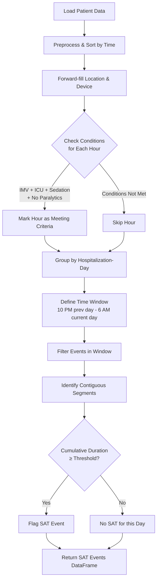
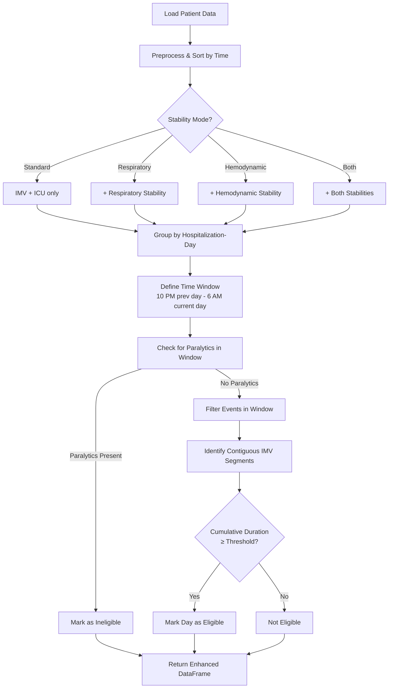

# SAT and SBT Flag Identification

The SAT (Spontaneous Awakening Trial) and SBT (Spontaneous Breathing Trial) flag identification utilities automatically detect these important clinical events from CLIF-formatted ICU data using objective documentation from medication administration and respiratory support records.

## Overview

SAT and SBT are critical components of evidence-based ICU liberation protocols:

- **SAT (Spontaneous Awakening Trial)** - Daily interruption or reduction of sedation to assess neurological function and readiness for weaning
- **SBT (Spontaneous Breathing Trial)** - Assessment of a patient's ability to breathe without mechanical ventilation support

These protocols, when implemented together, have been shown to:
- Reduce duration of mechanical ventilation
- Decrease ICU and hospital length of stay
- Lower rates of tracheostomy
- Reduce overall mortality

The CLIFpy SAT/SBT utilities identify these events based on objective EHR documentation, enabling quality improvement and research studies without relying solely on manual charting.

## Reference Implementation

These functions are based on the implementation from:
[CLIF_rule_based_SAT_SBT_signature](https://github.com/Common-Longitudinal-ICU-data-Format/CLIF_rule_based_SAT_SBT_signature)

## How It Works

### SAT Identification

SAT events are identified when patients meet specific conditions for a cumulative threshold duration within a defined time window:



**Default Criteria:**
- Patient on invasive mechanical ventilation (IMV)
- Located in ICU
- Receiving sedation (dose > 0)
- No paralytic medications
- Conditions met for ≥4 cumulative hours
- Evaluated in 10 PM - 6 AM window (overnight period)

### SBT Identification

SBT eligibility is determined with optional respiratory and hemodynamic stability requirements:



**Default Criteria:**
- Patient on IMV
- Located in ICU
- No paralytic medications
- Conditions met for ≥6 cumulative hours
- Evaluated in 10 PM - 6 AM window

**Stability Requirements (Optional):**
- **Respiratory Stability**: Low ventilator settings (PS ≤ 8, PEEP ≤ 8, FiO2 ≤ 0.5)
- **Hemodynamic Stability**: Low vasopressor support (NEE ≤ 0.1 mcg/kg/min)

## Basic Usage

### SAT Event Identification

```python
from clifpy.utils import identify_sat_events

# Identify SAT events from merged cohort data
sat_events = identify_sat_events(
    cohort=patient_data,
    threshold_hours=4.0,  # 4-hour threshold (default)
    window_start_hour=22,  # 10 PM (default)
    window_end_hour=6      # 6 AM (default)
)

print(f"Identified {len(sat_events)} SAT events")
print(sat_events[['hospitalization_id', 'current_day_key', 'event_time_at_threshold']])
```

**Required Columns in Input Data:**
- `event_time` (or custom time column)
- `hospitalization_id` (or custom ID column)
- `device_category` (e.g., 'imv')
- `location_category` (e.g., 'icu')
- `min_sedation_dose_2` (aggregate sedation dose)
- `max_paralytics` (aggregate paralytic dose)

**Output:**
- `hospitalization_id`: Patient identifier
- `current_day_key`: Date when SAT threshold was met
- `event_time_at_threshold`: Exact timestamp when cumulative threshold was reached

### SBT Event Identification

```python
from clifpy.utils import identify_sbt_events

# Standard SBT (no stability requirements)
sbt_standard = identify_sbt_events(
    cohort=patient_data,
    stability_mode='Standard',
    threshold_hours=6.0
)

# Count eligible days
eligible_count = sbt_standard['eligible_day'].sum()
print(f"Found {eligible_count} SBT-eligible hospitalization-days")
```

**Output Columns:**
- `eligible_day`: Binary flag (0/1) for SBT eligibility
- `IMV_Controlled_met_time`: Timestamp when threshold was reached
- `vent_day`: Binary flag for any ventilated day
- `vent_day_without_paralytics`: Binary flag for vent days without paralytics
- All original input columns

### Stability Calculations

```python
from clifpy.utils import (
    calculate_respiratory_stability,
    calculate_hemodynamic_stability
)

# Calculate respiratory stability
patient_data = calculate_respiratory_stability(
    patient_data,
    ps_threshold=8.0,
    peep_threshold=8.0,
    fio2_threshold=0.5
)

# Calculate hemodynamic stability using Norepinephrine Equivalent (NEE)
patient_data = calculate_hemodynamic_stability(
    patient_data,
    nee_threshold=0.1
)

# Now use stability flags for SBT identification
sbt_both = identify_sbt_events(
    cohort=patient_data,
    stability_mode='Both_stabilities'
)
```

## Advanced Usage

### Custom Column Names

Both functions support custom column naming:

```python
sat_events = identify_sat_events(
    cohort=data,
    time_column='recorded_dttm',
    hospitalization_id_column='encounter_id',
    device_category_column='resp_device',
    location_category_column='patient_location',
    sedation_column='total_sedation',
    paralytics_column='total_paralytics'
)
```

### Different Stability Modes

```python
# Standard: Only IMV and ICU location required
sbt = identify_sbt_events(cohort, stability_mode='Standard')

# Respiratory stability only
sbt = identify_sbt_events(cohort, stability_mode='Respiratory_Stability')

# Hemodynamic stability only
sbt = identify_sbt_events(cohort, stability_mode='Hemodynamic_Stability')

# Both stabilities (most restrictive)
sbt = identify_sbt_events(cohort, stability_mode='Both_stabilities')
```

### Custom Time Windows

```python
# Use different evaluation window (e.g., 8 PM - 8 AM)
sat_events = identify_sat_events(
    cohort=data,
    window_start_hour=20,  # 8 PM
    window_end_hour=8       # 8 AM
)
```

## Integration with CLIF Orchestrator

### Complete Workflow Example

```python
from clifpy import ClifOrchestrator
from clifpy.utils import (
    identify_sat_events,
    identify_sbt_events,
    calculate_respiratory_stability,
    calculate_hemodynamic_stability
)

# Load CLIF data
co = ClifOrchestrator(data_directory='/path/to/clif/data')

# Create merged cohort
# Merge respiratory_support, medication_admin_continuous, and adt tables
cohort = (
    co.respiratory_support.df
    .merge(
        co.medication_admin_continuous.df,
        left_on=['hospitalization_id', 'recorded_dttm'],
        right_on=['hospitalization_id', 'admin_dttm'],
        how='outer',
        suffixes=('_resp', '_med')
    )
    .merge(
        co.adt.df[['hospitalization_id', 'in_dttm', 'out_dttm', 'location_category']],
        on='hospitalization_id',
        how='left'
    )
)

# Use event_time from respiratory or medication data
cohort['event_time'] = cohort['recorded_dttm'].fillna(cohort['admin_dttm'])

# Filter to events within ADT time ranges
cohort = cohort[
    (cohort['event_time'] >= cohort['in_dttm']) &
    (cohort['event_time'] <= cohort['out_dttm'])
]

# Calculate aggregate medication doses (max across sedation types)
sedation_cols = ['propofol', 'midazolam', 'fentanyl', 'lorazepam']
cohort['min_sedation_dose_2'] = cohort[sedation_cols].max(axis=1)

paralytic_cols = ['cisatracurium', 'vecuronium', 'rocuronium']
cohort['max_paralytics'] = cohort[paralytic_cols].max(axis=1)

# Calculate stability flags
cohort = calculate_respiratory_stability(cohort)
cohort = calculate_hemodynamic_stability(cohort)

# Identify SAT events
sat_events = identify_sat_events(cohort)
print(f"SAT events: {len(sat_events)}")

# Identify SBT eligible days
sbt_eligible = identify_sbt_events(
    cohort,
    stability_mode='Both_stabilities'
)
print(f"SBT eligible days: {sbt_eligible['eligible_day'].sum()}")

# Save results
sat_events.to_csv('sat_events.csv', index=False)
sbt_eligible.to_csv('sbt_eligible_cohort.csv', index=False)
```

## Clinical Interpretation

### SAT Events

SAT events indicate periods when:
1. Sedation was present and then reduced/interrupted
2. Patient was on mechanical ventilation in the ICU
3. No paralytic medications were being administered
4. Conditions persisted for the specified duration

Use cases:
- **Quality Metrics**: Measure SAT protocol compliance
- **Outcome Analysis**: Correlate SAT delivery with clinical outcomes
- **Protocol Optimization**: Identify opportunities for improvement

### SBT Eligibility

SBT-eligible days represent opportunities for spontaneous breathing trials, which assess readiness for extubation.

Use cases:
- **Ventilator Liberation**: Identify candidates for extubation trials
- **Quality Improvement**: Measure gaps between eligibility and actual SBT delivery
- **Resource Planning**: Predict ventilator demand and ICU capacity
- **Research**: Study factors affecting successful extubation

## Configuration

### Respiratory Stability Thresholds

Default thresholds based on clinical guidelines:

```python
calculate_respiratory_stability(
    cohort,
    ps_threshold=8.0,      # Pressure Support ≤ 8 cmH2O
    peep_threshold=8.0,    # PEEP ≤ 8 cmH2O
    fio2_threshold=0.5     # FiO2 ≤ 50%
)
```

### Hemodynamic Stability (NEE Calculation)

Norepinephrine Equivalent (NEE) combines multiple vasopressors:

```
NEE = norepinephrine + epinephrine + (phenylephrine/10) + (vasopressin*2.5) + (dopamine/100)
```

Where:
- norepinephrine: dose in mcg/kg/min
- epinephrine: dose in mcg/kg/min
- phenylephrine: dose in mcg/kg/min (divided by 10 for equivalence)
- vasopressin: dose in units/min (multiplied by 2.5 for mcg/kg/min equivalence)
- dopamine: dose in mcg/kg/min (divided by 100 for equivalence)

Default threshold: NEE ≤ 0.1 mcg/kg/min

## Validation

The implementation has been validated against:
- Reference implementation from CLIF_rule_based_SAT_SBT_signature repository
- Comprehensive unit tests covering edge cases
- Clinical scenarios with known outcomes

## Limitations

### Data Requirements

- **Granularity**: Hourly or sub-hourly timestamped data recommended
- **Completeness**: Missing medication or respiratory data will affect detection
- **Accuracy**: Relies on accurate EHR documentation

### Clinical Context

- These flags identify *potential* SAT/SBT events based on objective data
- Clinical judgment should guide actual SAT/SBT delivery
- Not all identified events represent protocol-driven care
- Contraindications may exist that are not captured in structured data

### Time Window Assumptions

- Default 10 PM - 6 AM window reflects common overnight evaluation periods
- May not capture all institutions' protocols
- Customizable but should match local practice patterns

## Performance Considerations

- Processing time scales with cohort size
- Use `show_progress=True` for long-running analyses
- Consider processing in batches for very large datasets
- Pre-filtering to ICU patients can improve efficiency

## References

1. CLIF Rule-based SAT/SBT Signature Repository:
   https://github.com/Common-Longitudinal-ICU-data-Format/CLIF_rule_based_SAT_SBT_signature

2. Girard TD, et al. Efficacy and safety of a paired sedation and ventilator weaning protocol for mechanically ventilated patients in intensive care (Awakening and Breathing Controlled trial): a randomised controlled trial. Lancet. 2008;371(9607):126-34.

3. Barr J, et al. Clinical practice guidelines for the management of pain, agitation, and delirium in adult patients in the intensive care unit. Crit Care Med. 2013;41(1):263-306.

## Support

For questions or issues:
- GitHub Issues: https://github.com/Common-Longitudinal-ICU-data-Format/clifpy/issues
- CLIF Documentation: https://clif-icu.com

## See Also

- [API Documentation](../api/utilities.md) - Full function signatures and parameters
- [MDRO Flags](mdro-flags.md) - Multi-drug resistant organism identification
- [SOFA Scores](../api/utilities.md#sofa-scores) - Sequential Organ Failure Assessment
