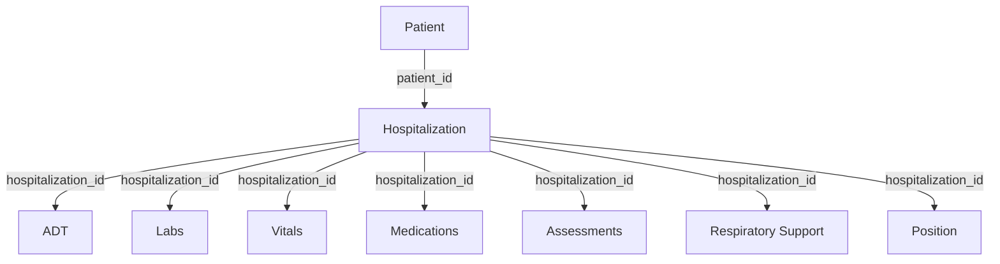

# CLIF Tables Overview

CLIFpy implements all 9 tables defined in the CLIF 2.0.0 specification. Each table represents a specific aspect of ICU patient data, with standardized columns and validation rules. Detailed CLIF Data Dictionary is available [here](https://clif-icu.com/data-dictionary)

## Data Standards

Each table follows CLIF standards for:

<div class="grid cards" markdown>

- 🏷️ **Standardized Categories**

    ---

    Consistent values across institutions, validated against permissible value lists, and mapped from institution-specific values.

- 🏥 **Source Preservation**

    ---

    Original EHR data elements maintained alongside standardized mappings for institutional transparency.

- 🕒 **Timezone Handling**

    ---

    All datetime columns are timezone-aware with consistent timezone across all tables and automatic conversion during loading.

- 🔑 **Composite Keys**

    ---

    Unique record identification with duplicate detection and data integrity validation.

</div>

## Available Tables




#### [Patient](patient.md)
Core demographic information including birth date, sex, race, ethnicity, and language. This is the primary table that links `patient_id` field to the `hospitalization_id` field in the Hospitalization table. For detailed API documentation, see [Patient API](../../api/tables.md#patient)

#### [ADT](adt.md) 
Admission, Discharge, and Transfer events tracking patient movement through different hospital locations (ICU, ward, ED, etc.).

#### [Hospitalization](hospitalization.md)
Hospital admission and discharge information, including admission source, discharge disposition, and length of stay.


#### [Labs](labs.md)
Laboratory test results with standardized categories (chemistry, hematology, etc.) and reference ranges.

#### [Microbiology Culture](microbiology-culture.md)
Microbiology Culture data includes order and result times of microbiology culture tests, the type of fluid collected, the component of the test, and the organism identified.

#### [Vitals](vitals.md)
Vital signs measurements including temperature, heart rate, blood pressure, respiratory rate, and oxygen saturation.

#### [Position](position.md)
Patient positioning data, particularly important for prone positioning in ARDS management.

#### [Respiratory Support](respiratory-support.md)
Ventilation and oxygen therapy data, including device types, settings, and observed values.

#### [Medications](medication-admin.md)
Continuous medication infusions with standardized drug categories and dosing information.


#### [Patient Assessments](patient-assessments.md)
Clinical assessment scores including GCS, RASS, CAM-ICU, pain scores, and other standardized assessments.

## Common Table Features

All tables inherit from `BaseTable` and share these features:

### Data Loading
```python
table = TableClass.from_file(
    data_directory='/path/to/data',
    filetype='parquet',
    timezone='US/Central'
)
```

### Validation
```python
table.validate()
if table.isvalid():
    print("Validation passed")
```

### Summary Statistics
```python
summary = table.get_summary()
print(f"Rows: {summary['num_rows']}")
print(f"Memory: {summary['memory_usage_mb']} MB")
```


## Choosing Tables for Your Analysis

### For Patient Cohort Building
- Start with `Patient` for demographics
- Add `Hospitalization` for admission criteria
- Include `ADT` for ICU/location-specific cohorts

### For Clinical Outcomes
- Use `Labs` for laboratory markers
- Add `Vitals` for physiological parameters
- Include `PatientAssessments` for severity scores

### For Treatment Analysis
- Use `RespiratorySupport` for ventilation data
- Add `MedicationAdminContinuous` for drug therapy
- Include `Position` for positioning interventions


## Next Steps

- Explore individual table guides for detailed usage
- Learn about [data validation](../validation.md)
- See [practical examples](../../examples/index.md)
- Review the [API reference](../../api/tables.md)