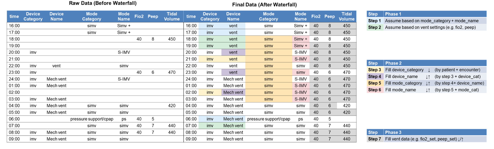

# Respiratory Support Waterfall Processing

The waterfall method provides a sophisticated data cleaning and imputation pipeline for respiratory support data, ensuring continuous and complete ventilator records for analysis.

## Overview

The waterfall processing transforms raw, sparse respiratory support data into a dense, analysis-ready dataset by:
- Creating hourly scaffolds for continuous timelines
- Inferring missing device and mode information
- Forward-filling numeric values within ventilation episodes
- Applying clinical logic and heuristics



## Usage

### Basic Usage

```python
from clifpy.tables.respiratory_support import RespiratorySupport

# Load your respiratory support data
resp_support = RespiratorySupport.from_file(
    data_directory="/path/to/data",
    filetype="parquet"
)

# Apply waterfall processing
processed = resp_support.waterfall()

# The result is a new RespiratorySupport instance
processed.validate()  # Validate the processed data
df = processed.df     # Access the DataFrame
```

### Advanced Options

```python
# Enable backward fill for numeric values
processed = resp_support.waterfall(bfill=True)

# Use a different ID column for grouping
processed = resp_support.waterfall(id_col="patient_id")

# Get just the DataFrame
df = resp_support.waterfall(return_dataframe=True)

# Silent mode (no progress messages)
processed = resp_support.waterfall(verbose=False)
```

### Timezone Handling

The waterfall function expects data in UTC timezone. If your data is in a different timezone, it will be automatically converted:

```python
# Your data is in US/Eastern
processed = resp_support.waterfall(verbose=True)
# Output: "Converting timezone from US/Eastern to UTC for waterfall processing"
```

## Processing Pipeline

The waterfall processing consists of five phases:

### Phase 0: Initialize & Build Hourly Scaffold

* **Lower-case all text columns** - Standardizes device and mode names for consistent matching
* **Coerce numeric setters to floats** - Ensures all numeric columns have proper data types
* **Scale FiO₂ if needed** - Corrects common documentation errors (e.g., 40 → 0.40)
* **Create hourly scaffold** - Inserts synthetic rows at **HH:59:59** for each hour
  - Ensures every patient has a dense, regular timeline
  - Vital for plots, per-hour metrics, and length-of-stay calculations
  - These scaffold rows serve as "landing spots" for forward-fill operations

### Phase 1: Device/Mode Heuristics

Applies intelligent rules to repair missing device and mode labels:

* **IMV from mode strings** - Infers invasive mechanical ventilation from mode categories
* **Look-ahead/behind logic** - Uses surrounding context to fill gaps
* **Device-specific repairs**:
  - BiPAP device name standardization
  - Nasal cannula PEEP guards
  - Mode category inference
* **Data cleaning**:
  - Removes rows with no usable information
  - Handles timestamp duplicates
  - Prioritizes non-NIPPV entries when duplicates exist

### Phase 2: Hierarchical IDs

Creates four nested run-length identifiers within each encounter:

```
device_cat_id → device_id → mode_cat_id → mode_name_id
```

* Each ID increments when its label or parent ID changes
* Enables tracking of ventilation episodes and mode transitions
* Provides grouping keys for the numeric fill phase

Example progression:
```
Time  Device_Category  Device_Cat_ID  Mode_Category  Mode_Cat_ID
10:00 IMV             1              AC/VC          1
11:00 IMV             1              AC/VC          1
12:00 IMV             1              SIMV           2  ← mode change
13:00 NIPPV           2              CPAP           3  ← device change
```

### Phase 3: Numeric Waterfall

Performs intelligent filling of numeric values within each `mode_name_id` block:

* **Forward-fill by default** - Carries last known settings forward
* **Optional backward-fill** - When `bfill=True`, also fills backwards
* **Special handling**:
  - FiO₂ defaults to 0.21 for room air
  - Tidal volume blanked for pressure support modes
  - Trach collar acts as a "breaker" for fills
* **Preserves clinical logic** - Respects mode transitions and device changes

### Phase 4: Final Tidy-up

* **De-duplicate rows** - Ensures one row per timestamp
* **Sort chronologically** - Orders by encounter and time
* **Forward-fill tracheostomy flag** - Carries trach status through entire encounter
* **Clean up helper columns** - Removes temporary calculation fields
* **Preserve scaffold indicator** - `is_scaffold` column marks synthetic rows

## Output Format

The processed DataFrame includes:

### Original Columns (cleaned and filled)
- All original respiratory support columns
- Numeric values filled within appropriate contexts
- Categorical values standardized and inferred

### New Columns
- `device_cat_id` - Device category episode ID
- `device_id` - Device instance episode ID  
- `mode_cat_id` - Mode category episode ID
- `mode_name_id` - Mode instance episode ID
- `is_scaffold` - Boolean flag for synthetic hourly rows

## Example

```python
import pandas as pd
from clifpy.tables.respiratory_support import RespiratorySupport

# Sample data with gaps
data = pd.DataFrame({
    'hospitalization_id': ['H001', 'H001', 'H001'],
    'recorded_dttm': pd.to_datetime([
        '2023-01-01 10:30', 
        '2023-01-01 14:15',  # 4-hour gap
        '2023-01-01 15:00'
    ]).tz_localize('UTC'),
    'device_category': ['imv', None, 'imv'],  # Missing value
    'fio2_set': [0.5, None, 0.4],
    'peep_set': [8, None, 10],
    # ... other columns
})

# Create instance and process
rs = RespiratorySupport(data=data)
processed = rs.waterfall()

# Result will have:
# - Hourly rows at 11:59:59, 12:59:59, 13:59:59
# - Device category filled for 14:15 row
# - FiO₂ and PEEP carried forward through gaps
# - Hierarchical IDs tracking ventilation episodes
```

## Clinical Considerations

1. **Scaffold rows are synthetic** - Filter by `is_scaffold == False` for actual observations
2. **Fills respect clinical boundaries** - Values don't cross mode/device transitions
3. **Room air defaults** - FiO₂ set to 0.21 (21%) for room air observations
4. **Tracheostomy persistence** - Once documented, carries through admission

## Performance Notes

- Processing time scales with number of encounters and data density
- Memory usage increases due to hourly scaffold creation
- Consider processing in batches for very large datasets

## See Also

- [Respiratory Support Table](tables.md#respiratory-support) - Table schema and validation
- [Wide Dataset Creation](wide-dataset.md) - Creating analysis-ready datasets
- [Data Validation](validation.md) - Understanding validation errors
- [Timezone Handling](timezones.md) - Working with different timezones